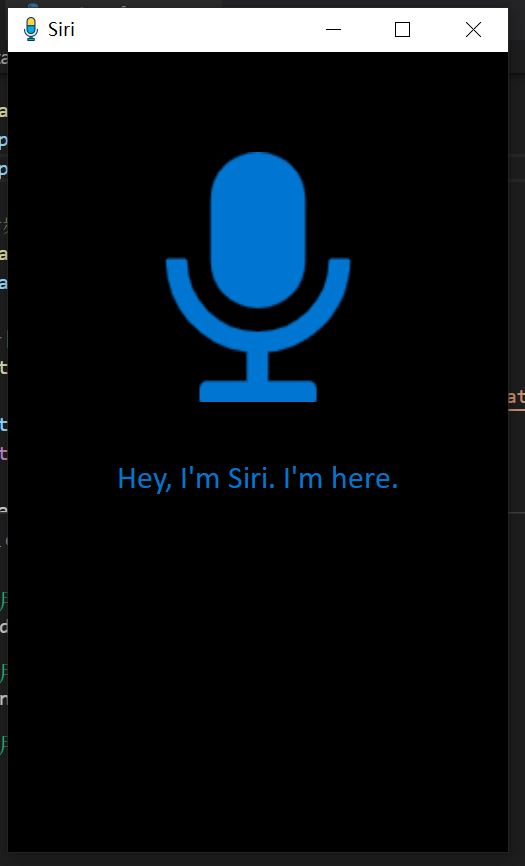
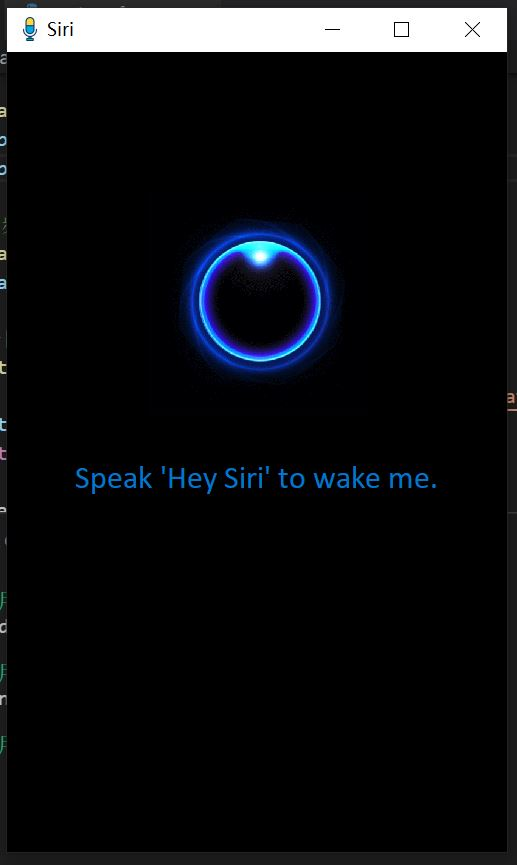
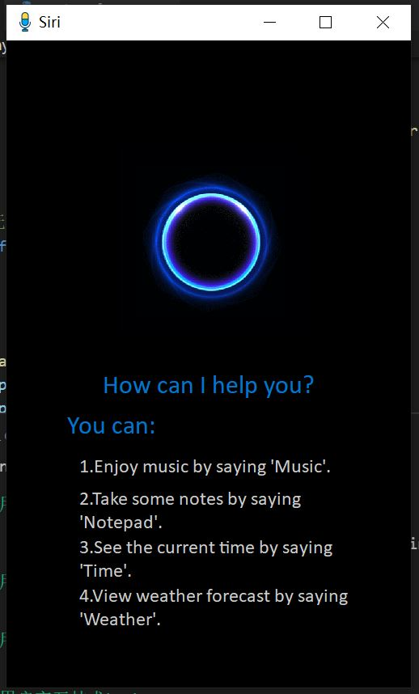

# Lab 1: Automatic Speech Recognition

> * 学号：1851197
> * 姓名：周楷彬

* 目录结构：

  * `asr.py`：语音识别助手主程序
  * `asrInterface.py`：语音识别助手界面代码
  * `siri/`：语音识别助手音频文件
  * `music/`：音乐文件
  * `icon/`：图标文件
* 依赖：
  * PyQT5
  * speech_recognition
  * playsound
  * difflib
  * requests

---

## Modifications

* 对UI进行了简单的修改，添加了开始界面、唤醒界面、帮助界面、识别命令界面
* 添加了语音识别交互功能，能够识别播放音乐、打开记事本、查看时间、查看天气四条命令

---

## GUI

### 1. 开始界面



* Siri播放音频“Hey, I'm Siri. I'm here.”后显示主界面

### 2. 主界面



* 用户说出“Hey Siri”唤醒Siri，SIri开始识别用户的语音命令

### 3. 唤醒界面



* 播放音频“How can I help you?”
* 用户说出指令，Siri识别命令并执行
* 支持四条指令：
  * Music：播放音乐
  * Notepad：打开记事本
  * Time：查看时间
  * Weather：查看今日天气

---

### 4. 识别成功界面


* 命令识别成功后显示，并执行相应的命令

---

### 5.识别失败界面


* 命令识别失败

---

### 6. 查看天气界面


* “Weather”命令会查询并显示今日上海天气

---

###  7.查看时间界面


* “Time”命令会能显示当前时间

---

## Code

### 1. 语音识别

* 通过麦克风检测用户的语音命令，通过语音识别将命令转化为文本

``` python
recognizer = sr.Recognizer()
microphone = sr.Microphone()

#监听麦克风，语音识别
with microphone as source:
    recognizer.adjust_for_ambient_noise(source)
    audio = recognizer.listen(source)

#识别命令
command = recognizer.recognize_sphinx(audio)
```

### 2. 字符串相似度计算

* 由于语音识别准确度较低，很难准确地识别出命令

* 因此通过计算识别结果与已有命令的字符串相似度，找出相似度最大的命令作为识别结果

* 唤醒过程：识别结果与"Hey, Siri"的相似度大于0.1，则唤醒成功

* 识别命令过程：识别结果与命令的相似度大于0.3，则成功识别到命令

* 代码：

  * 字符串相似度：

    ```python
    """
    字符串相似度
    """
    def string_similarity(s1, s2):
        return difflib.SequenceMatcher(None, s1, s2).quick_ratio()
    ```

  * 唤醒过程：

    ```python
    """
    Hey Siri唤醒
    """
    similarity = string_similarity(command,"Hey Siri")
    print(f"相似度: {similarity}")
    if similarity > 0.1:
    	self.wakeSuccess()
    else:
    	print("唤醒Siri失败！")
    ```

  * 识别命令过程：

    ```python
    """
    识别命令
    """
    command_list = [ "music","notepad","calculator","weather"]
    similarity_list = [ string_similarity(command,c) for c in command_list ]
    #找到相似度最大的命令
    similarity_max = max(similarity_list)
    index_max = similarity_list.index(similarity_max)
    if similarity_max < 0.3:
    	print("无法识别命令！")
    	self.recognitionFail()
    else:
    	print("Command:{}".format(command_list[index_max]))
    ```

### 3. 执行命令

* 支持四条指令：

  * 播放音乐、打开记事本通过调用系统接口实现

    ```python
    """
    执行命令
    """
    if index_max==0:
        os.startfile("music\\Canon.mp3")
    elif index_max==1:
    	os.system("notepad")
    elif index_max==2:
    	self.ui.displayTime()
    elif index_max==3:
    	weather = getWeather()
    	self.ui.displayWeather(weather)
    
  ```
  
  
  
* 查看时间通过time获取时间，定时器每秒更新一次时间
  
    ```python
    def update_time(self):
    	_translate = QtCore.QCoreApplication.translate
    	self.label_time.setText(_translate("MainWindow",time.strftime('%X', time.localtime())))
    ```
    
  * 查看今日天气通过调用天气查询API实现
  
    ```python
    """
    查询今日上海天气
    """
    def getWeather():
        rb = requests.get('http://wthrcdn.etouch.cn/weather_mini?city=上海')
        data = json.loads(rb.text)
        return data['data']['forecast'][0]
    ```

---

## Accuracy

* **识别效果：**speech_recognition语音识别效果非常差，基本没有完全识别正确的情况
* **Improve：**
  * **字符串相似度：**通过计算字符串相似度找出相似度最大的命令作为识别结果，能提高识别成功率，但识别结果大部分情况仍与正确结果不匹配
  * **文字转语音：**通过在线的文字转语音服务合成音频文件，读取音频文件作为命令，有效提高了识别准确率，虽然字符串相似度仅能达到0.75，但大部分情况能够匹配正确
  * **调用其它语音识别接口：**科大讯飞、百度语音识别都有可用的SDK，识别效果较好，但需要联网，故未使用
