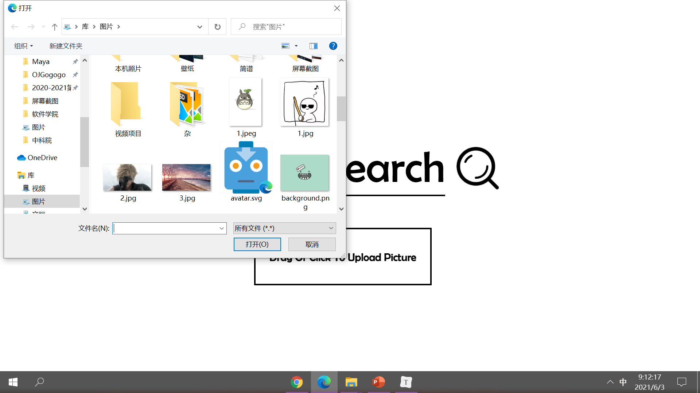
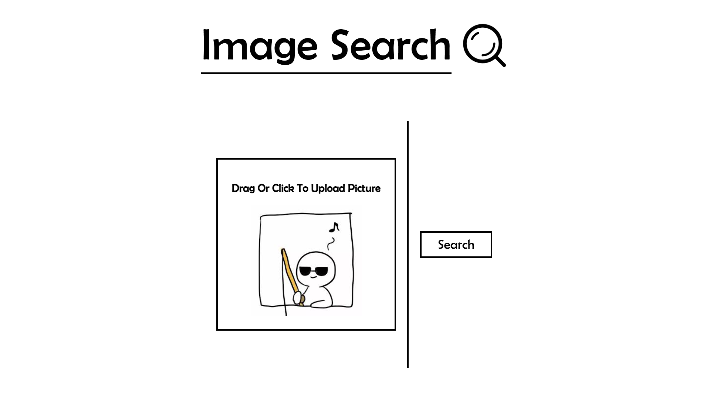
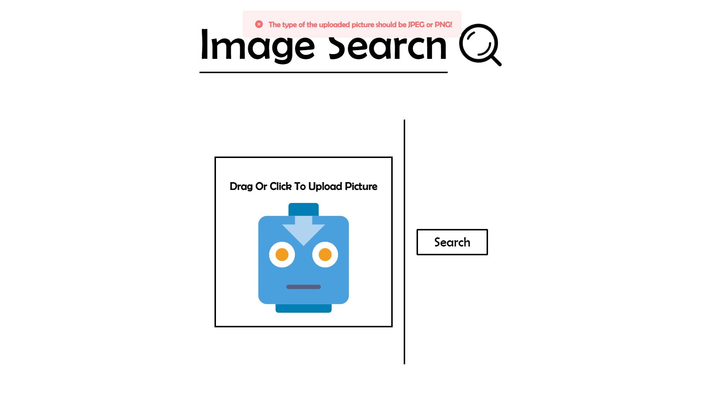
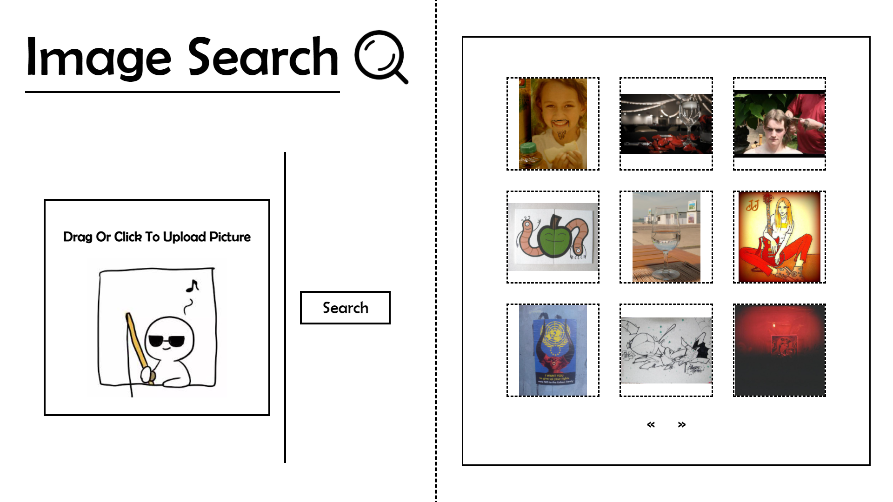
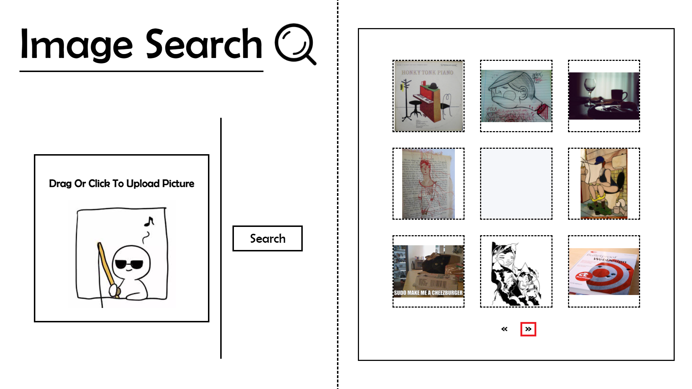
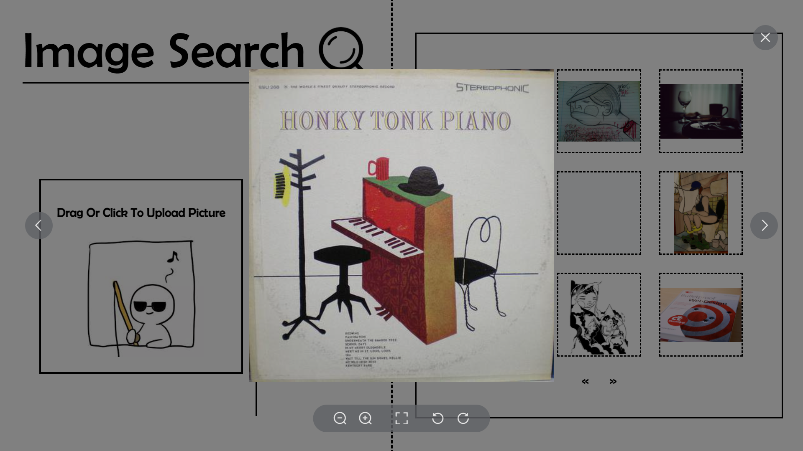

# Lab 2: Information Retrieval

> * 学号：1851197
> * 姓名：周楷彬

## Describe the requirements of an image search task

* A homepage which hold a brief introduction to let the user know what can this image search engine do
* The way that this engine provide to upload your image
* Users can preview the query image in the searching window
* Provide a **Search button** to search image
* Show a waiting animation when the engine is searching
* Users can preview the thumbnails of the results
* Users can click a result the see the detail

---

## Five-stage search framework

### 1. Formulation

* Homepage

   

  

* Users can drag a picture file into the upload area or click the upload area to upload a picture

  

* Users can preview the picture before uploading

  

### 2. Initiation of action

* A **Search** button

  
  
* Only **PNG** or **JPG/JPEG** file can be uploaded

  

### 3. Review of results

* Preview the thumbnails of the results

  

### 4. Refinement

* Click the $\mathbf{\ll}$ or $\mathbf{\gg}$ button to change the page of the results

   

### 5. Use 

* Click the result picture to see the detail

  

