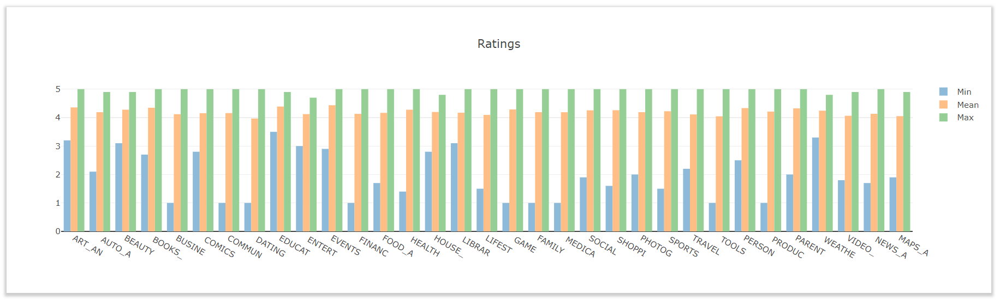
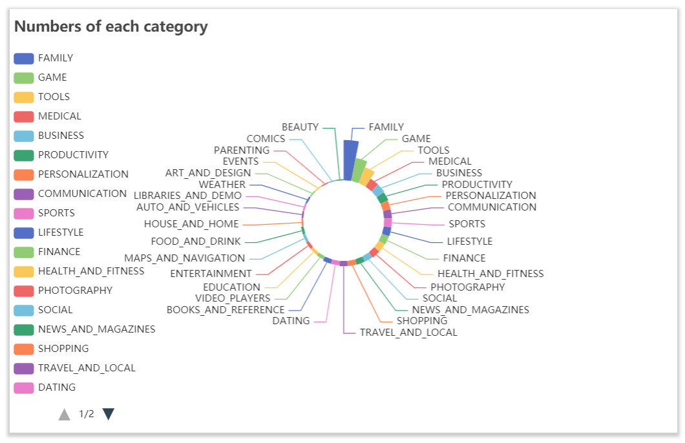
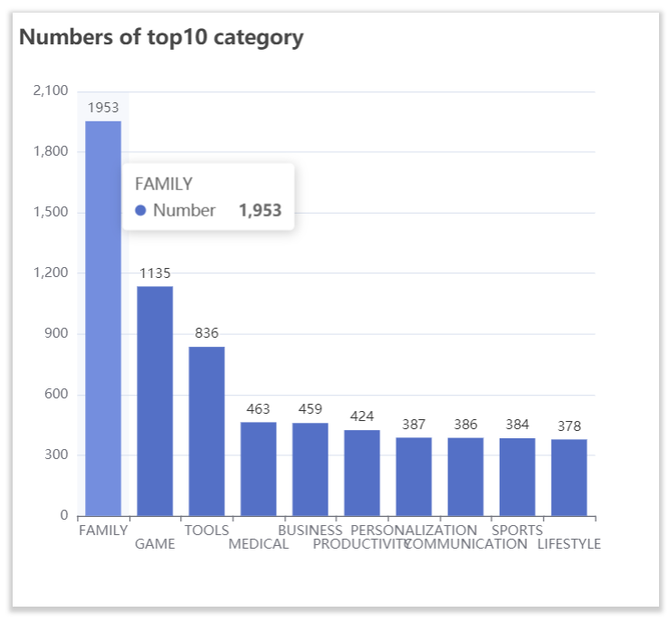
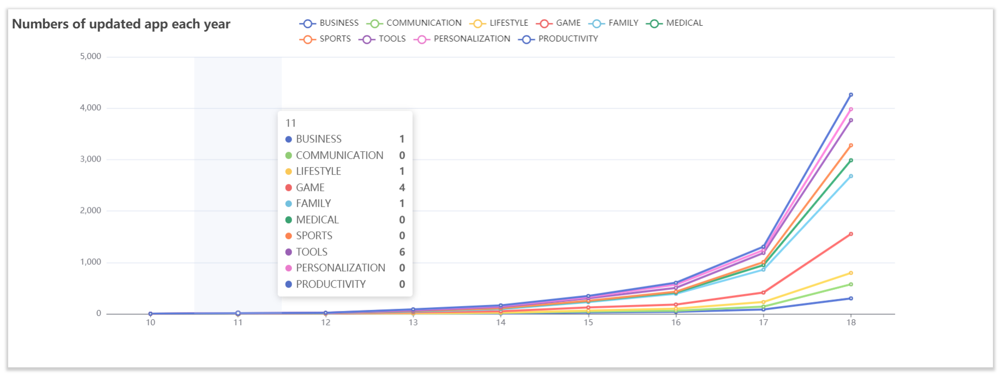
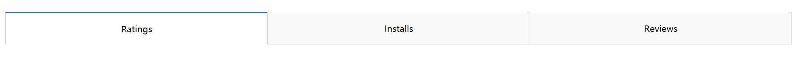
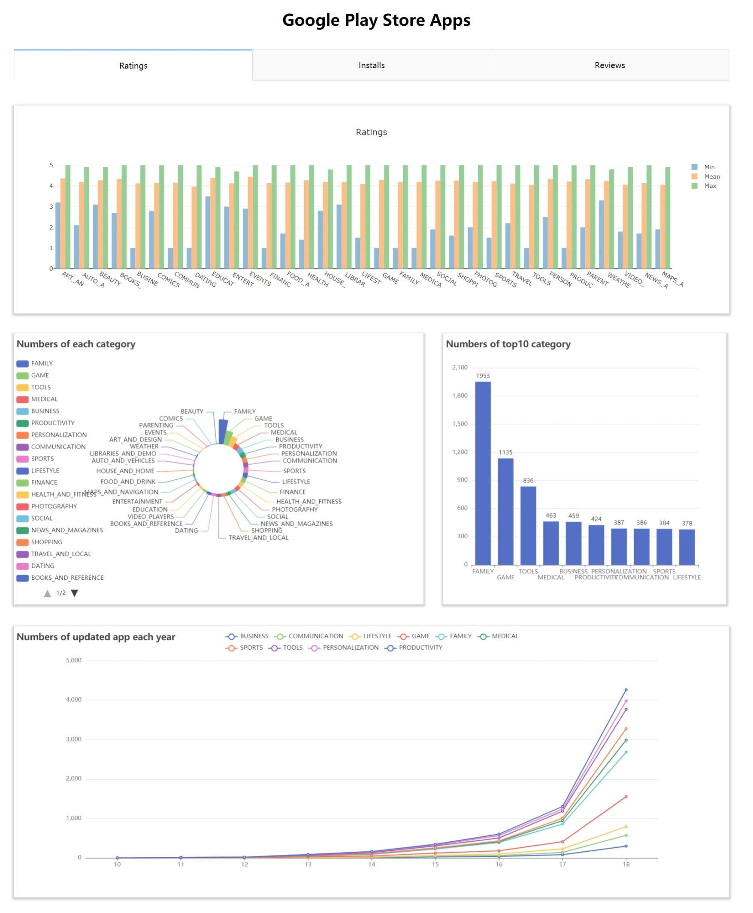

# Lab 3：Data Visualization

> * 学号：1851197
> * 姓名：周楷彬

## 1. Dataset

1. The dataset I have chosen is **Google playstore**.

   > All data was obtained from the Wall Street Journal based on data from Payscale, Inc

2. The dataset consists of the following 13 variables:
   * `App`: The name of the application
   * `Category`: The category of the app
   * `Rating`: The average rating of the app
   * `Reviews`: The total number of reviews for the app
   * `Size`: The size of the app's storage
   * `Installs`: The total number of installs of the app
   * `Type`: Whether the app is free or not
   * `Price`: The price of the app
   * `Content Rating`: The age limit of the app's users
   * `Genres`: The genre of app
   * `Last Updated`: When the app was last updated
   * `Current Ver`: The most recent version of the app
   * `Android Ver`: The required Android version of the app

---

## 2. Data Analysis 

### **2.1 Data Analysis Task**

* **Task One：**Analyze the maximum, average and minimum values of the number of different categories of application ratings and application installations, as well as the number of application reviews.
* **Task Two：**Analyze the number of different categories of apps and focus on the ten categories with the highest number
* **Task Three：**Analyze the timing of application updates to obtain the number of applications updated in each category for each year.

---

### **2.2 Data Analysis Process**

First analyze the **maximum**, **average** and **minimum** values for the number of app **ratings** and app **installs**, and the number of app **reviews**.

(Take the scoring of an application as an example.)

Filter the app with ratings and later count the ratings for each category.

```python
data_has_rating = [item for item in data if not np.isnan(float(item["Rating"]))]
category_rating = {}
for item in data_has_rating:
    category = item['Category']
    if category not in category_rating:
        category_rating[category] = [float(item['Rating'])]
    else:
        category_rating[category].append(float(item['Rating']))
category_rating_mean = [[key, np.mean(item)] for (key, item) in category_rating.items()]
category_rating_max = [[key, np.max(item)] for (key, item) in category_rating.items()]
category_rating_min = [[key, np.min(item)] for (key, item) in category_rating.items()]
```

This page uses **bar charts** to display the maximum, average and minimum values for the app ratings and the number of app installs, the number of app reviews.



In order to analyze the application category variables, first filter out the categories with a total number of applications category than 10.

```python
category_count = category_count[category_count.values > 10]categories = []
```

For the filtered data, calculate the **total number** of applications for **each category**.

```python
for i, item in enumerate(list(category_count.keys())[:10]):
    item = item
    if i % 2 == 0:
        categories.append(item)
    else:
        categories.append("\n" + item)
counts = list(category_count.values)
```

The web page uses **pie chart** to represent the **percentage** of different categories of applications in terms of volume.



The page uses **bar chart** to show the **total number** of the ten most numerous **categories** of applications.



I chose to analyze the timing of application updates to obtain the number of applications updated in each category for each year.

```python
all_time = []
category_count_update = {}
for item in data:
    category = item['Category']
    if category not in list(category_count[:10].index):
        continue
    update_time = item['Last Updated'][-2:]
    if update_time not in all_time:
        all_time.append(update_time)
    if category not in category_count_update:
        category_count_update[category] = {update_time: 1}
    else:
        if update_time in category_count_update[category]:
            category_count_update[category][update_time] += 1
        else:
            category_count_update[category][update_time] = 1

all_time.sort()
for category, data in category_count_update.items():
    for t in all_time:
        if t not in data:
            category_count_update[category][t] = 0
    category_count_update[category] = [category_count_update[category][t] for t in all_time]
```

The page uses **line chart** to show the number of applications **updated each year**.



---

## 3. Layout design

As the data categories of ratings, number of installs and number of reviews for applications are similar, the charts are also similar.

So a **tab bar** is added to the top of the page and the user selects one of the tabs and the bar chart is displayed as the corresponding data analysis chart.



The containers below the bar chart are divided into left and right sides.

The **left** side shows a **line chart** of the number of different categories of applications and the **right** side shows its **bar chart**.

Further down is the number of updates per year for different categories of applications.

A general overview of the page is shown below.




